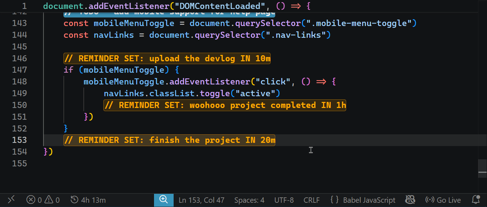

# remind-me README

a vscode productivity extension that helps you set reminders for upcoming tasks. :)

## Features

- `TODO highlighting` : you can highlight your TODOs using this extension. you simply have to type `#TODO` as a comment, followed by the text you want to save as the TODO text. e.g. usage: `// #TODO improve workflow`

- `Reminder setup` : you can set reminders for future tasks and updates using this extension. the command for the reminder setup is `// #REMIND`. 

### REMINDER SETUP

- Use the command `// #REMIND` to call a reminder at any line that you want.
- You will see a popup which asks you to enter the info of the reminder. The syntax of it is: `[time][unit] [task]` where unit means S,H,M meaning second,hour,minute respectively. Example usage: `10m coffee break`
- Then press enter and VOILA!!! your reminder has been set!! 
- Now, you must see a line highlighted with yellow color saying `//REMINDER SET: <UR TITLE> IN <UR TIME>`. If you see this, then you will surely get a notification within vscode after the time you have set has passed.
- the gif given below explains this process quite well :)

## FAQ

#### What if I set a lot of reminders? How can I manage multiple reminders? 
*(Similar: How can I cancel a reminder that I have setup?)*
- If you have a lot of reminders and want to cancel any one of them, then dont worry. This extension has a command to help you. You simply have to follow these steps:

1. Press `Ctrl+Shift+P` to fire up the command palette.
2. Type `delete active reminders` and you will see an option saying `remindMe: Manage/Delete active reminders`. Press enter.
3. Now you will see a popup window with your active reminders lists (ONLY IF YOU HAVE GOT ANY ACTIVE REMINDER).
4. Choose the reminders that you want to delete and press `OK`.
5. WOOHOO! The reminder/s have been deleted.

*reference gif below*

#### How can I remove the `//REMINDER SET:` line after the reminder has finished its job of reminding me. Will I have to remove each and every REMINDER SET lines from my code?
- Dont worry, we have a simple command that helps you with this. You will have to go to a ride to the command palette with us ;)

1. Press `Ctrl+Shift+P` to fire up the command palette.
2. Type `remove all residue lines` and you will see an option saying `remindMe: Remove all residue lines`. Press enter.
3. VOILAAA! All the yellow highlighted lines that are left after the reminder has finished its job, have been removed!! 

*reference gif below*

## Requirements

This extension is very easy to setup and use. Simply install it and its ready!! Yep! Its that simple. 

## Extension Commands

* `remindMe.deleteReminders`: Manage/Delete active reminders.
* `remindMe.removeResidue`: Clean reminder residue from file.

## Known Issues

Please make sure that you have turned off Do Not Disturb mode before using the remind feature because it doesnot work with the DND feature turned on. 

## Release Notes

### 1.0.0

Initial release of the remindMe extension. It includes the TODO highlighting, Reminder setup, Reminder delete and Remove residue reminder features. These features are the core of this extension. this version is just a basic MVP of this extension.

**happy coding ;)**
